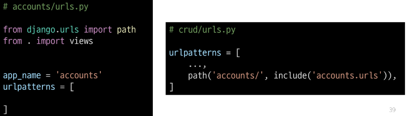

# Django Authentication System
- 사용자 인증과 관련된 기능을 모아 놓은 시스템

# Authentication (인증)
- 사용자가 자신이 누구인지 확인하는 것 (신원 확인)

# 사전준비
- 두번째 app accounts 생성 및 등록
- auth와 관련한 경로나 키워드들을 django 내부적으로 accounts라는 이름으로 사용하기 때문에 권장

# 기존 User Model의 한계
- 우리는 지금까지 auth 앱에 작성된 User 클래스를 사욯암
- Django의 기본 User 모델은 username,password등 제공 되는 필드가 제한적
- 추가적인 정보가 필요하면 ,기본 User Model을 변경하기 어려움

# User Model 대체의 필요성
- 프로젝트의 특정 요구사항에 맞춰 사용자 모델을 확장할 수 있음
- 이메일을 username으로 사용하거나, 다른 추가 필드를 포함시킬 수 있음

# Custom User Model로 대체하기(1/3)
- AbstractUser 클래스를 상속 받는 커스텀 User클래스 작성
- 기존 user클래스도 AbstractUser를 상속 받기 때문에 기존 User클래스와 완전히 같은 모습을 가지게 됨

# Custom User Model로 대체하기(2/3)
- django 프로젝트에서 사용하는 기본 User 모델을 우리가 작성한 User 모델로 사용할 수 있도록 AUTH_USER_MODEL값 변경

# Custom User Model로 대체하기(3/3)
- admin site에 대체한 User 모델 등록
- 기본 User 모델이 아니기 때문에 등록하지 않으면 admin 페이지에 출력되지 않기 때문

# AUTH_USER_MODEL
- Django 프로젝트의 User를 나타내는데 사용하는 모델을 지정하는 속성
# !주의!
- 프로젝트 중간에 AUTH_USER_MODEL을 변경할 수 없음
- 진행되고 있을 경우 DB초기화 후 진행