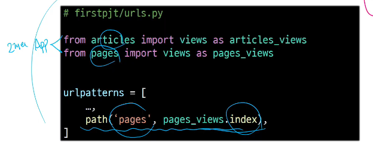
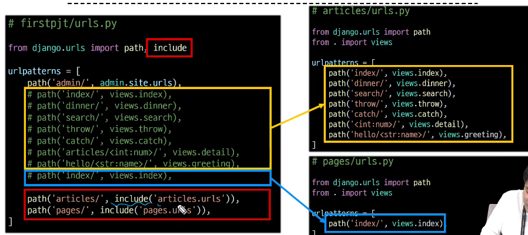
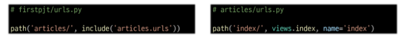

# 금일 중요 핵심




# Django 설치
- pip install Django
# Django 프로젝트 생성
- django-damin startproject firstpjt .
# 서버 실행
- python manage.py runserver

---

# Design Pattern
- 디자인패턴
    - 소프트웨어 설계에서 발생하는 문제를 해결하기 위한 일반적인 해결책

# MVC 디자인 패턴
- Model, View, Controller
- 애플리케이션을 구조화하는 대표적인 패턴
# MTV 디자인 패턴
- Model, Template, View
- Django에서 애플리케이션을 구조화하는 패턴(기존 MVC 패턴과 동일하나 단순히 명칭을 다르게 정의한 것)

---

# Django project 
- 애플리케이션의 집합(DB설정, URL연결, 전체 앱 설정 등을 처리)
# Django application
- 독립적으로 작동하는 기능 단위 모듈(각자 특정한 기능을 담당하며 다른 앱들과 함께 하나의 프로젝트를 구성)


# 앱 생성
```
$ python manage.py startapp articels
```