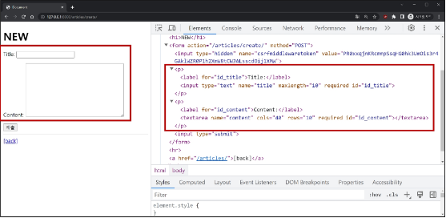
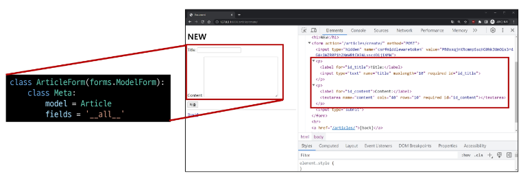

# Form 과 ModelForm 차이
- Form
    - 사용자 입력 데이터를 **DB에 저장하지 않을 때**
    - ex) 검색, 로그인
- ModelForm
    - 사용자 입력 데이터를 **DB에 저장해야 할 때**
    - ex) 게시글 작성, 회원가입

# ModelForm
- Model과 연결된 Form을 자동으로 생성해주는 기능을 제공
- Form + Model
```python
# articles/forms.py
from django import forms
from .models import Article
class ArticleForm(forms.ModelForm):
    class Meta:
        model = Article
        fields = '__all__'
```
# ModelForm class 적용

# ModelForm class 가 대체하는 것

