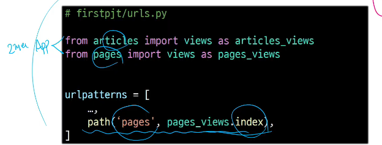

# URL dispatcher
- URL패턴을 정의하고 해당 패턴이 일치하는 요청을 처리할 view 함수를 연결(매핑)

# Variable Routing
- URL 일부에 변수를 포함시키는 것(변수는 view 함수의 인자로 전달 할 수 있음)

# Variable routing 작성법
```
path('articles/<int:num>/' , views.detail)
path('hello/<str:name>/' , views.greeting)
```
- <**path_converter** : **variable_name**>
# Path converters
- URL 변수의 타입을 지정(str, int등 5가지 타입 지원)


# App URL mapping
- 각 앱에 URL을 정의하는 것
- 프로젝트와 각 앱이 URL을 나누어 관리를 편하게 하기 위함

# 2번째 앱 pages 생성 후 발생할 수 있는 문제
- view 함수 이름이 같거나 같은 패턴의 URL 주소를 사용하게 되는 경우
- 아래 코드와 같이 해결해 볼 수 있으나 더 좋은 방법이 필요
- "URL을 각자 app에서 관리하자"

## URL 구조 변화


# include()
- 프로젝트 내부 앱들의 URL을 참조할 수 있도록 매핑하는 함수
- URL의 일치하는 부분까지 잘라내고, 남은 문자열 부분은 후속 처리를 위해 include된 URL로 전달

# URL 구조 변경에 따른 문제점
- 기존 'articles/'주소가 'articles/index/'로 변경됨에 따라 해당 url을 사용하는 모든 위치를 찾아가 변경해야 함
- "URL에 이름을 지어주면 이름만 기억하면 되지 않을까?"


# Naming URL patterns
- URL에 이름을 지정하는 것
- path 함수의 name 인자를 정의해서 사용

# URL 표기 변화
- url을 작성하는 모든 곳에서 변경(a 태그의 href 속성 값 뿐만 아니라 form의 action 속성 등도 포함)

