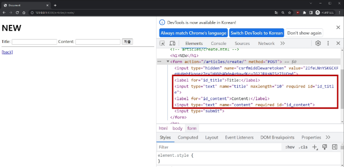
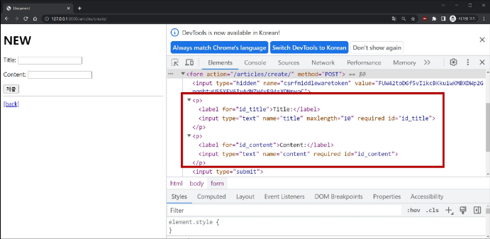
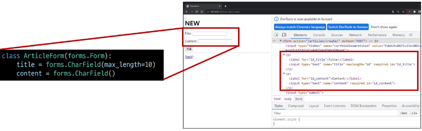
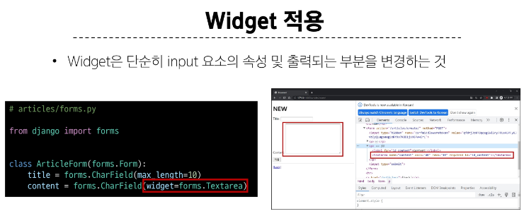

#  HTML 'form'
- 지금까지 사용자로부터 데이터를 제출 받기위해 활용한 방법 그러나 비정상적 혹은 악의적인 요청을 필터링 할 수 없음
- 유효한 데이터인지에 대한 확인이 필요

# 유효성 검사
- 수집한 데이터가 정확하고 유효한지 확인하는 과정

# 유효성 검사 구현의 어려움
- 유효성 검사를 구현하기 위해서는 입력 값, 형식, 중복, 범위, 보안 등 많은 것들을 고려해야 함
- 이런 과정과 기능을 직접 개발이 아닌, Django가 제공하는 Form을 사용

# Django Form
- 사용자 입력 데이터를 수집하고, 처리 및 유효성 검사를 수행하기 위한 도구
- 유효성 검사를 단순화하고 자동화 할 수 있는 기능을 제공

```python
# articles/forms.py
from django import forms
class ArticleForm(forms.Form):
    title = forms.CharField(max_lengt=10)
    content = forms.CharField()
```

# Form class를 적용한 new 로직 (1/3)
- view 함수 new 변경
```python
# articles/views.py
from .froms import ArticleForm
def new(request):
    form = ArticleForm()
    context = {
        'form' : form,
    }
    return render(request, 'articles/new.html', context)
```

# Form class를 적용한 new 로직 (2/3)
- new 페이지에서 form 인스턴스 출력
```django
<!-- articles/new.html -->
<h1>NEW</h1>
<form action="" method="POST">
    
    {{ form }}
    <input type='submit'>
</form>
```

# Form class를 적용한 new 로직 (3/3)


# Form rendering options (1/2)
- label, input 쌍을 특정 HTML 태그로 감싸는 옵션
```django
<!-- articles/new.html -->
<h1>NEW</h1>
<form action="" method="POST">
    
    {{ form.as_p }}
    <input type="submit">
</form>
```

# Form rendering options (2/2)


# Form class가 대체하는 것


# Widgets
- HTML의 input 표현을 담당

# Widget 적용
- Widget은 단순히 input 요소의 속성 및 출력되는 부분을 변경하는 것
