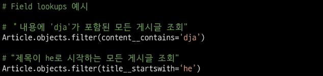

# Django shell
- Django 환경 안에서 실행되는 python shell
- 입력하는 QuerySet API 구문이 Django 프로젝트에 영향을 미침

# Create
# 데이터 객체를 만드는 방법
- Article.objects.create(title="title", content="content")
# save()
- 객체를 데이터베이스에 저장하는 인스턴스 메서드

# Read
# 대표적인 조회 메서드
- Return new QuerySets
    - all()
    - filter()
- Do not return QuerySets
    - get()

# all()
- 전체 데이터 조회
- **Article.obejcts.all()**

# filter()
- 주어진 매개변수와 일치하는 객체를 포함하는 QuerySet 반환
- **Article.objects.filter(content="content")**

# get()
- 주어진 매개변수와 일치하는 객체 반환
- **Article.objects.get(pk=1)**

# get() 특징
- 찾을 수 없으면 DoesNotExist 예외 발생, 둘 이상 객체를 찾으면 MultipleObjectsReturned 예외 발생
- primary key와 같이 고유성을 보장하는 조회에서 사용

# Update
- Article.objects.filter(title="title").update(title="title1")

# Delete
- article.delete()
- (1, 'articles.Article' : 1)

# Filed lookups
- Query에서 조건을 구성하는 방법
- QuerySet 메서드 filter(),exclude() 및 get()에 대한 키워드 인자로 지정됨

# ORM, QuerySet API를 사용하는 이유
1. 데이터베이스 추상황
    - 개발자는 특정 데이터베이스 시스템에 종속되지 않고 일관된 방식으로 데이터를 다룰 수 있음
2. 생산성 향상
    - 복잡한 SQL 쿼리를 직접 장성하는 대신 Python 코드로 데이터베이스 작업을 수행 할 수 있음
3. 객체 지향적 접근
    - 데이터베이스 테이블을 Python 객체로 다룰 수 있어 객체 지향 프로그래밍의 이점을 활용 할 수 있음