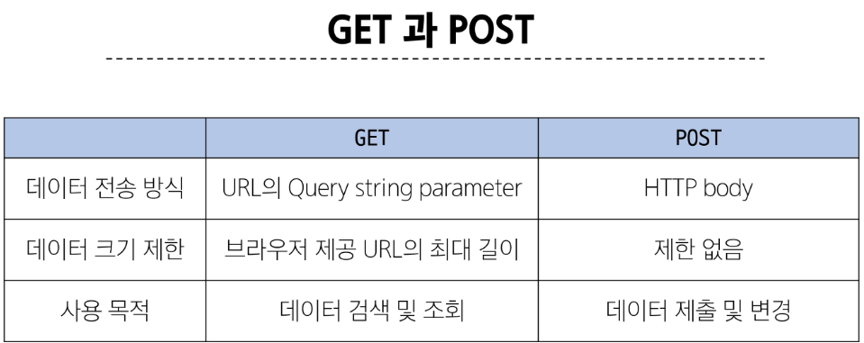

# HTTP
- 네트워크 상에서 데이터(리소스)를 주고 받기위한 약속
# HTTP request methods
- 데이터에 대해 수행을 원하는 작업(행동)을 나타내는 것
    - 서버에게 원하는 작업의 종류를 알려주는 역할
- 클라이언트가 웹 서버에 특정 동작을 요청하기 위해 사용하는 표준 명령어
- 대표 메서드
    - GET, POST

# GET
- 서버로부터 데이터를 요청하고 받아오는데 사용 (조회)
# GET 특징
1. 데이터 전송
    - URL의 쿼리 문자열을 통해 데이터를 전송
2. 데이터 제한
    - URL 길이에 제한이 있어 대량의 데이터 전송에는 적합하지 않음
3. 브라우저 히스토리
    - 요청 URL이 브라우저 히스토리에 남음
4. 캐싱
    - 브라우저는 GET요청의 응답을 로컬에 저장할 수 있음
    - 동일한 URL로 다시 요청할 때, 서버에 접속하지 않고 저장된 결과를 사용
    - 페이지 로딩 시간을 크게 단축
# GET 사용 예시
- 검색 쿼리 전송
- 웹 페이지 요청
- API에서 데이터 조회

# POST
- 서버에 데이터를 제출하여 리소스를 변경하는데 사용 (생성,수정,삭제)
# POST 특징
1. 데이터 전송
    - HTTP Body를 통해 데이터를 전송
2. 데이터 제한
    - GET에 비해 더 많은 양의 데이터를 전송할 수 있음
3. 브라우저 히스토리
    - POST 요청은 브라우저 히스토리에 남지 않음
4. 캐싱
    - POST 요청은 기본적으로 캐시 할 수 없음
    - POST 요청이 일반적으로 서버의 상태를 변경하는 작업을 수행하기 때문
# POST 예시
- 로그인 정보 제출
- 파일 업로드
- 새 데이터 생성 (예: 새 게시글 작성)
- API에서 데이터 변경 요청

# GET & POST 정리
- GET과POST는 각각의 특성에 맞게 적절히 사용해야 함
- GET
    - 데이터 조회
- POST
    - 데이터 생성이나 수정에 주로 사용

# GET 요청이 필요한 경우
- 캐싱 및 성능
    - GET 요청은 캐시 (Cache) 될 수 있고, 이전에 요청한 정보를 새로 요청하지 않고 사용할 수 있음
    - 특히, 동일한 검색 결과를 여러번 요청하는 경우 GET 요청은 캐시를 활용하여 더 빠르게 응답 가능
- 가시성 및 공유
    - GET요청은 URL에 데이터가 노출되어 있기 때문에 사용자가 해당 URL을 북마크하거나 다른 사람과 공유하기 용이
- RESTful API 설계
    - HTTP 메서드의 의미에 따라 동작하도록 디자인된 API의 일관성을 유지할 수 있음