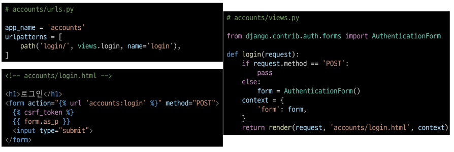
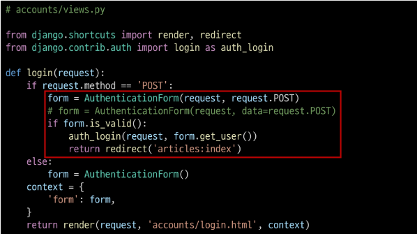
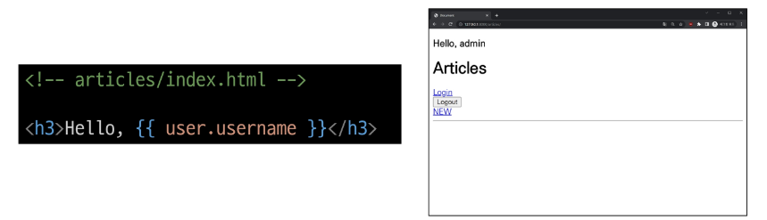
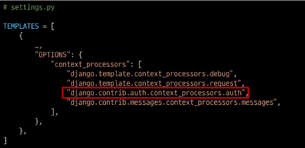

# Login
- 로그인은 Session을 Create하는 과정

# AuthenticatinoForm()
- 로그인 인증에 사용할 데이터를 입력 받는 built-in form

# 로그인 페이지 작성

# 로그인 로직 작성

# login(request, user)
- AuthenticationForm을 통해 인증된 사용자를 로그인 하는 함수

# get_user()
- AuthenticatinoForm의 인스턴스 메서드
- 유효성 검사를 통과했을 경우 로그인 한 사용자 객체를 반환

# Template with Authentication data
- 템플릿에서 인증 관련 데이터를 출력하는 방법

# 현재 로그인 되어있는 유저 정보 출력
- user라는 context 데이터를 사용할 수 있는 이유
    - django가 미리 준비한 context 데이터가 존재하기 때문

# context processors
- 템플릿이 렌더링 될 때 호출 가능한 컨텍스트 데이터 목록
- 작성된 컨텍스트 데이터는 기본적으로 템플릿에서 사용 가능한 변수로 포함
- django에서 자주 사용하는 데이터목록을 미리 템플릿에 로드해 둔 것

# 쿠키 종류별 수명
1. Session cookie
    - 현재 섹션(current session)이 종료 되면 삭제
    - 브라우저 종료와 함께 세션이 삭제
2. Persistent cookies
    - Expires 속성에 지정된 날짜 혹은 Max-Age 속성에 지정된 기간이 지나면 삭제됨

# 쿠키의 보안 장치
- 제한된 정보
    - 쿠키에는 보통 중요하지 않은 정보만 저장 (사용자 ID나 세션번호 등)
- 암호화
    - 중요한 정보는 서버에서 암호화해서 쿠키에 저장
- 만료 시간
    - 쿠키에는 만료 시간을 설정 시간이 지나면 자동으로 삭제
- 도메인 제한
    - 쿠키는 특정 웹사이트에서만 사용할 수 있도록 설정할 수 있음

# 쿠키와 개인정보 보호
- 많은 국가에서 쿠키 사용에 대한 사용자 동의를 요구하는 법규 시행
- 웹사이트는 쿠키 정책을 명시하고, 필요한 경우 사용자의 동의를 얻어야함

# 세션 in Django
- Django는 'database-backed sessions' 저장 방식을 기본 값 사용
- session 정보는 DB의 **django_session** 테이블에 저장
- Django는 요청안에 특정 session id 를 포함하는 쿠키를 사용해서 각각의 브라우저와 상티ㅡ가 연결된 session 데이터를 알아냄
- Django는 우리가 session 메커니즘에 대부분을 생각하지 않게끔 많은 도움을 줌