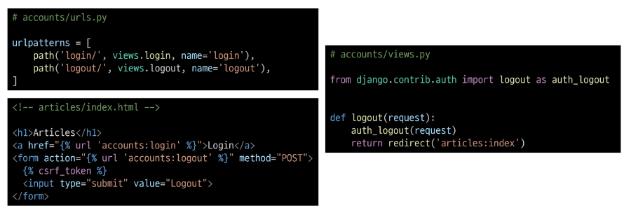
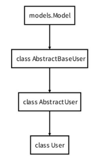

# Logout
- 로그아웃은 Session을 Delete하는 과정

# logout(request)
- DB에서 현재 요청에 대한 Session Data삭제
- 클라이언트의 쿠키에서도 Session Id 삭제

# 로그아웃 로직 작성

# 'AbstractUser' class
- 관리자 권한과 함께 완전한 기능을 가지고 있는 User model을 구현하는 추상 기본클래스

# Abstract base classes (추상 기본 클래스)
- 몇 가지 공통 정보를 여러 다른 모델에 넣을 때 사용하는 클래스
- 데이터베이스 테이블을 만드는데 사용되지 않으며, 대신 다른 모델의 기본 클래스로 사용되는 경우 해당 필드가 하위 클래스의 필드에 추가 됨

# User 모델 상속 관계
