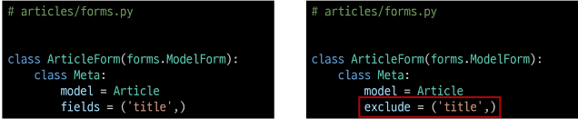

# Meta class
- ModelForm의 정보를 작성하는 곳

# 'fields'및'exclued'속성
- exclude 속성을 사용하여 모델에서 포함되지 않을 필드를 지정할 수도 있음

# Meta class 주의사항
- Django에서 ModelForm에 대한 추가 정보나 속성을 작성하는 클래스 구조를 Meta클래스로 작성 했을 뿐이며, 파이썬의 inner class와 같은 문법적인 관점으로 접근하지 말 것