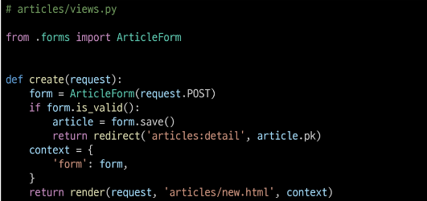

# Meta class
- ModelForm의 정보를 작성하는 곳

# 'fields'및'exclued'속성
- exclude 속성을 사용하여 모델에서 포함되지 않을 필드를 지정할 수도 있음

# Meta class 주의사항
- Django에서 ModelForm에 대한 추가 정보나 속성을 작성하는 클래스 구조를 Meta클래스로 작성 했을 뿐이며, 파이썬의 inner class와 같은 문법적인 관점으로 접근하지 말 것

# ModelForm을 적용한 create로직

# is_valid()
- 여러 유효성 검사를 실행하고, 데이터가 유효한지 여부를 Boolean으로 반환

# ModelForm 을 적용한 edit 로직

# ModelForm 을 적용한 update 로직

# save()
- 데이터베이스 객체를 만들고 저장하는 ModelForm의 인스턴스 메서드
# save() 메서드가 생성과 수정을 구분하는 법
- instace 여부를 통해 생성할 지 , 수정할 지 결정

# Django Form 정리
- 사용자로부터 데이터를 수집하고 처리하기 위한 강력하고 유연한 도구
- HTML form의 생성, 데이터 유효성 검사 및 처리를 쉽게 할 수 있도록 도움
