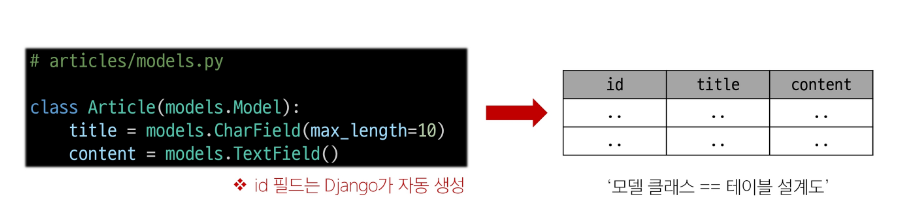
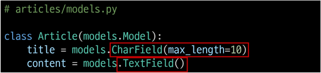

# Django Model
- DB의 테이블을 정의하고 데이터를 조작할 수 있는 기능들을 제공
- 테이블 구조를 설계하는 '청사진(blueprint)'
# Model 클래스 작성
```python
class Article(models.Model):
    title = models.CharField(max_lenth=10)
    content = models.TextField()
```
# model 클래스 살펴보기 (1/4)
- 작성한 모델 클래스는 최종적으로 DB에 다음과 같은 테이블 구조를 만듦

# model 클래스 살펴보기 (2/4)
- django.db.models 모듈의 Model이라는 부모 클래스를 상속받음
- Model은 model에 관련된 모든 코드가 이미 작성 되어있는 클래스
- 개발자는 가장 중요한 **테이블 구조를 어떻게 설계할지에 대한 코드만 작성하도록** 하기 위한 것
# model 클래스 살펴보기 (3/4)
- 클래스 변수명
    - 테이블의 각 "필드(열) 이름"
# model 클래스 살펴보기 (4/4)
- Model Field
    - 데이터베이스 테이블의 열(column)을 나타내는 중요한 구성요소
    - "데이터의 유형"과 "제약 조건"을 정의

