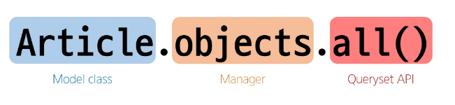

# ORM
- 객체 지향 프로그래밍 언어를 사용하여 호환되지 않는 유형의 시스템 간에 데이터를 변환하는 기술
# ORM의 역할 (1/2)
- Django와 DB간에 사용하는 언어가 다르기 때문에 소통 불가
# ORM의 역할 (2/2)
- Django에 내장된 ORM이 중간에서 이를 해석

# QuerySet API
- **python의 모델 클래스와 인스턴스를 활용해 DB에 데이터를 저장,조회,수정,삭제하는 것**
- ORM에서 데이터를 검색, 필터링, 정렬 및 그룹화 하는데 사용하는 도구
- API를 사용하여 SQL이 아닌 Python 코드로 데이터를 처리

# QuerySet API 구문

# Query
- 데이터베이스에 특정한 데이터를 보여 달라는 요청
- "쿼리문을 작성한다."
    - 원하는 데이터를 얻기 위해 데이터베이스에 요청을 보낼 코드를 작성한다
- 파이썬으로 작성한 코드가 ORM에 의해 SQL로 변환되어 데이터베이스에 전달되며, 데이터베이스의 응답 데이터를 ORM이 QuerySet이라는 자료 형태로 변환하여 우리에게 전달

# QuerySet
- 데이터베이스에게서 전달 받은 객체 목록 (데이터모음)
    - 순회가 가능한 데이터로써 1개 이상의 데이터를 불러와 사용할 수 있음
- Django ORM을 통해 만들어진 자료형
- 단, 데이터베이스가 단일한 객체를 반환 할 때는 QuerySet이 아닌 모델(Class)의 인스턴스로 반환됨

# CRUD
- 소프트웨어가 가지는 기본적인 데이터 처리 기능
- Create(저장)
- Read(조회)
- Update(갱신)
- Delete(삭제)
