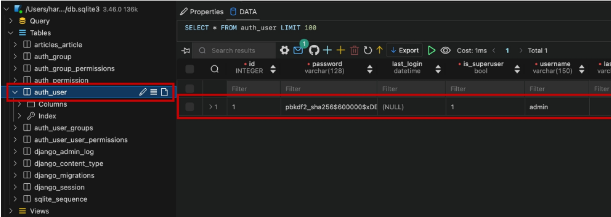
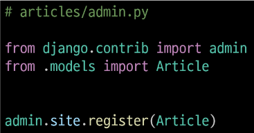
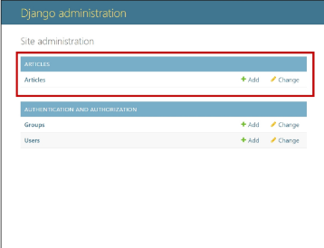
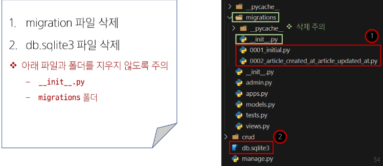

# Automatic admin interface
- Django가 추가 설치 및 설정 없이 자동으로 제공하는 관리자 인터페이스
- 데이터 확인 및 테스트 등을 진행하는데 매우 유용

# admin 게정 생성
- email은 선택사항이기 때문에 입력하지 않고 진행 가능
- 비밀번호 입력 시 보안상 터미널에 출력되지 않으니 무시하고 입력 하기
```python
python manage.py createsuperuser
```

# DB에 생성된 admin 계정 확인


# admin에 모델 클래스 등록
- admin.py에 작성한 모델 클래스를 등록해야만 admin site에서 확인 가능


# admin site 로그인 후 등록된 모델 클래스 확인


# 데이터베이스 초기화


# Migrations 기타 명령어
```python
pyton manage.py showmigrations
```
- migrations 파일들이 migrate 됐는지 안됐는지 확인 명령어
- [X]표시가 있으면 migrate가 완료되었음을 의미

```python
python manage.py sqlmigrate articles 0001
```
- 해당 migrations 파일이 SQL 언어로 어떻게 번역 되어 DB에 전달되는지 확인하는 명령어
