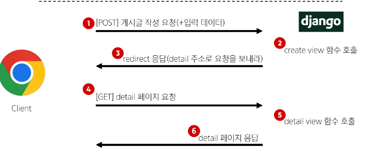

# Redirect
- 서버는 데이터 저장 후 페이지를 응답하는 것이 아닌 사용자를 적절한 기존 페이지로 보내야한다.

# redirect()
- 클라이언트가 인자에 작성된 주소로 다시 요청을 보내도록 하는 함수

# redirect 동작 원리
1. redirect 응답을 받은 클라이언트는 detail url로 다시 요청을 보내게 됨
2. 결과적으로 detail view함수가 호출되어 detail view 함수의 반환 결과인 detail 페이지를 응답 받게 되는 것
- 결국 사용자는 게시글 작성 후 작성된 게시글의 detail 페이지로 이동하는 것으로 느끼게 됨

