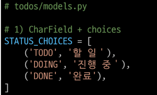

# AbstractUser
- 과거 Django의 기본 User model과 동일 한 모습으로 대체만 한 상황

# AbstractUser의 필드

# AbstructUser을 사용해 기본 User를 대체하는 이유
- 우리는 더 많은 **사용자 정보**를 관리하고 싶다

# 커스터마이징 사례
- 커뮤니티사이트-나이,성별,프로필 사진등 프로필 정보를 추가 필요
- 도서관련사이트-주간독서량,관심장르,연간 독서량 정보 필요
- 하지만 AbstractUser는 기본적으로 이런 필드들을 제공 안함.
- 우리가 직접 **사용자 모델을 확장**해야한다.

# AbstractUser도 결국..
- User모델도 결국 Django의 일반적인 Model 개념을 확장한 것

# Choices 속성
- 해당 필드에 선택할 수 있는 (제한된) 값 목록을 지정할 수 있음
    - Dropdown/ Radio 형태 변경 가능

# Choices 속성 기본 사용법
- STATUS_CHOICES
    - 튜플(혹은 리스트)의 리스트 형태
    - "TODO"는 DB에 저장되는 값, '할 일'은 관리자 페이지나 Form등에서 표기되는 값."(DB에 저장될 값, 사람이 보기 위한 값)"구조를 가짐
    

# choices 속성 사용 목적
- 데이터 무결성
    - 특정 필드가 특정 범위의 값 만을 가질 수 있도록 제약
- 가독성
    - 직관적인 선택 UI를 제공

# choices 변수명 정의 하는 법
- GENDER_CHOICES나 STATUS_CHOICES 등의 대문자 명명을 예제로 주로 사용
- 필수는 아니지만, 이런 이름이 흔히 볼 수 있는 전형적인 예시

# CharField와 choices
1. STATUS_CHOICES 리스트 정의
    - DB에는 'TODO', 'DOING', 'DONE'이 저장
    - Admin site나 Django Form에서는 "할 일", "진행 중", "완료"라는 레이블로 표시됨
    
2. 필드 정의
    - choices:미리 정의된 값듦나 선택할 수 있도록 제한
    - default:사용자가 값을 입력하지 않았을 때 자동으로 할당되는 기본 값
    - help_text:Admin이나 Form에서 해당 필드 옆에 간단한 안내문으로 표시되는 설명
    - verbose_name:Admin이나 Form에서 필드의 라벨로 표시될 텍스트
ㄴ
3. Admin Site결과 확인
- 새로운 할 일 등록 시 출력되는 라벨과 help text를 확인할 수 있음

# IntegerField와 choices
1. PRIORITY_CHOICES 리스트 정의
    - DB에는 정수 1,2,3이 저장
    - Admin site나 Django Form에서는 낮음,보통,높음 으로 표시됨

2. Admin Site결과 확인

# 정리
- choices가 DB/Form/UI에 미치는 영향
    - DB에는 키(key)값만 저장됨 (예:'DONE',1)
    - DJango Admin/Form 에는 라벨 값이 보임 (예,할 일, 낮음)
- choices를 통해 DB에서는 제한된 값을 저장하고, Form/UI에서는 사용자가 드롭다운으로 편리하게 선택하도록 하며, 무결성과 가독성을 동시에 충족할 수 있음

# PositiveIntegerField
- 0 이상의 정수만을 저장하기 위한 필드
- SQL 상에서는 일반 정수 타입으로 저장되지만, Django의 유효성 검증과 DB레벨제약을 통해 음수 값이 들어갈 수 없도록 관리함
- 활용
    - 나이, 재고 수량, 포인트, 주간 평균 독서 시간 등의 데이터를 저장해야 할 때 유용
# 사용 예시

- 데이터 무결성
    - 실제 우선순위가 음수가 될 일은 없으므로, 애초에 DB에 음수가 들어가지 않도록 방지
- 유효성 검사
    - Django가 자동으로 0 이상 값만 허용하므로, 음수 입력시 ValidationError 발생
- 가독성/의도 표현
    - 우선순위 = 양의 정수 라는 로직이 모델 정의에 드러나, 코드 유지보수에 유리함

# blank vs null 비교

- 폼에서 빈 값 허용(blank=True)은 DB의 NULL과 직접 대응하지 않는다.
- DB컬럼을 NULL허용(null=True)해도, 폼 입력에서는 여전히 필수 값이 될 수 있다.

# blank=True 의미
1. Form 유효성 검사 차원
    - blank=True로 지정된 필드는 폼에서 필수 입력이 아님
    - Admin이나 ModelForm에서 해당 필드를 비워 제출해도 검증 에러가 발생 안함.
2. DB와는 무관
    - 단지 Django의 form이나 admin에서 '비워둘 수 있다'는 의미
    - DB에는 ""(빈 문자열)로 저장될 수 있지만,
    - 실제로 DB가 NULL상태가 되는 것은 아님(기본적으로 null=False일 때)

# null=True 의미
1. DB스키마 레벨
    - null=True면 해당 컬럼에 NULL 값을 저장 가능
2. Form 검증과는 별개
    - Django Form에서 blank=True가 아니면 여전히 필수 입력으로 간주
    - 즉, DB에서 NULL을 허용하더라도, Form에서 공백 제출을 막을 수 있음

# 문자열 필드에서의 주의사항
- 문자열(예:CharField, TextField)의 겨우, 대부분 null=True를 설정하지 않는 것이 일반적
- 빈 문자열만으로 '값이 없음'을 표현 할 수 있으므로,굳이 NULL 상태와 구분해야 하는 사오항이 드뭄
- blank=True만 사용하여 "사용자가 입력해도 되고,안 해도 된다"는 설정을 할 수 있음
- null=True가 있으면, DB에 NULL과 빈 문자열이 모두 존재할 수 있어, 두 상태를 구분할 실익이 없는 한 혼동만 커질 수 있음

# 정리
- blank
    - 사용자가 이 필드를 비워도 되는가? 를 결정 (Form/Admin 레벨)
- null
    - DB컬럼에서 NULL값이 들어갈 수 있는가? 를 결정
- 문자열 필드
    - 필요하지 않다면 null=True는 지양 (빈 문자열과 NULL이 이중으로 관리되어 혼란)
    