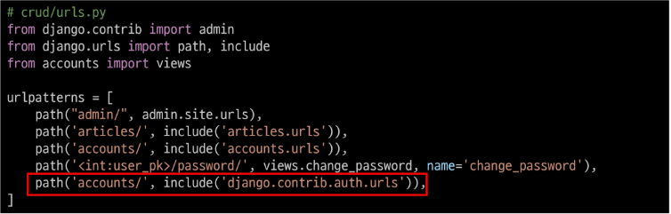
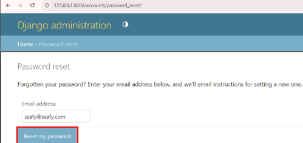
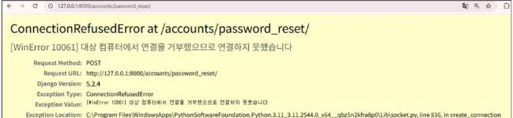
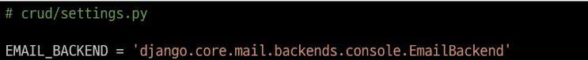

# 비밀번호 초기화
- 비밀번호를 잊어버린 사용자가 이메일을 활용하여 비밀번호를 다시 설정하는 과정
- 비밀번호 초기화 과정
    1. 비밀번호 찾기가 필요한 이메일 입력
    2. 이메일로 비밀번호 재설정 링크를 전송
    3. 비밀번호 재설정 페이지에서 새로운 비밀번호 설정
    4. 초기화 후 다시 로그인

# 비밀번호 찾기가 필요한 이메일 입력
- 이메일을 입력하는 페이지를 직접 만들어야할까?
    - Nooo
- DJango에서는 비밀번호에 관련된 다양한 기능을 관리자 페이지로 제공
- Django에서 제공하는 비밀번호 관련 기능을 활용하기 위해 django.contrib.auth.urls를 crud/urls.py에 포함

# 이메일로 비밀번호 재설정 링크를 전송
- 비밀번호를 찾으려고 하는 이메일을 작성하고 'Reser my password'버튼을 눌러 이메일 전송
- 입력한 이메일에 매칭되는 사용자 이메일이 없다면 이메일 기능은 동작하지 않음

- 이메일 전송 관련 설정을 따로 하지 않았기 때문에 이메일 전송 실패

- Django에서는 이메일을 보낸 내용을 콘솔에서 볼 수 있는 기능을 제공
- settings.py에서 EMAIL_BACKEND 세팅

# Django에서는 수많은 '완성된 기능 모듈'을 제공
- 단순하게 '비밀번호 초기화'기능을 구현한 것이 아니라, **잘 만들어진 모듈을 활용하는 법**을 학습한 것
    - Django.contrib.auth.urls 외에도 sessions, sitemaps 등 다양한 기능을 제공
    - 이메일 서버가 없어도 테스트가 가능한 것처럼, 실제 서비스 환경을 흉내 내는 많은 모듈을 제공하고 있음
- 이런 다양한 모듈을 활용해서 개발 기술을 숙련하는데 활용
