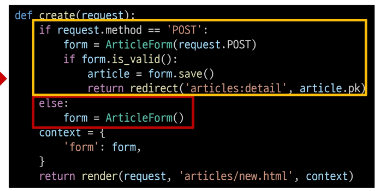

# 함수 결합
- HTTP request method 차이점을 활용해 동일한 목적을 가지는 2개의 view 함수를 하나로 구조화

# new & create 함수 결합

# new & create 함수 결합 (2/2)

# 새로운 create view 함수

# 기존 new 관련 코드 수정

- new 관련 키워드를 create로 변경

- render에서 new 템플릿을 create템플릿으로 변경

# edit & update 함수 결합
- 기존 edit과 update view 함수 결합

# 기존 edit 관련 코드 수정
- 사용하지 않는 edit url 제거

- edit 관련 키워드를 update로 변경

# 참고
## ModelForm 키워드 인자 data와 instance 살펴보기
- data는 첫번쨰에 위치한 키워드 인자이기 때문에 생략 가능
- instance는 9번쨰에 위치한 키워드 인자이기 때문에 생략할 수 없었음

## Widgets 응용(1/2)

## 필드를 수동으로 렌더링 하기
