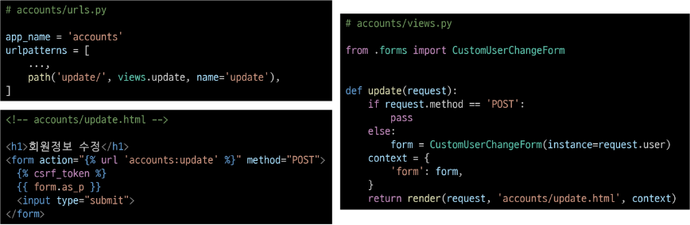
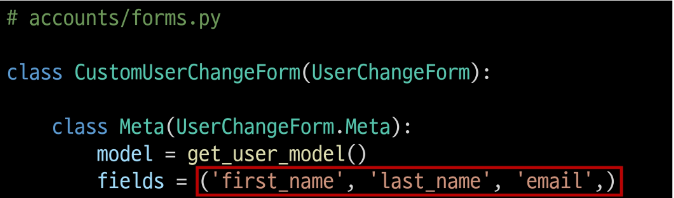
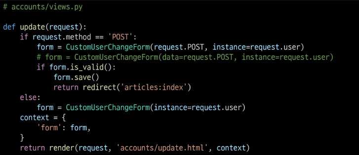

# 회원정보 수정
- User 객체를 Update하는 과정

# UserChangeForm()
- 회원정보 수정 시 사용자 입력 데이터를 받는 built-in ModelForm

# 회원정보 수정 페이지 작성

# UserChangeForm 사용 시 문제점
- User모델의 모든 정보들(fields)까지 모두 출력됨
- 일반 사용자들이 접근해서는 안되는 정보는 출력하지 않게 해야 함
- CustomUserChangeForm에서 출력 필드를 다시 조정하기

# CustomUserChangeForm 출력 필드 재정의
- User Model의 필드 목록 확인

# 회원정보 수정 로직 완성
